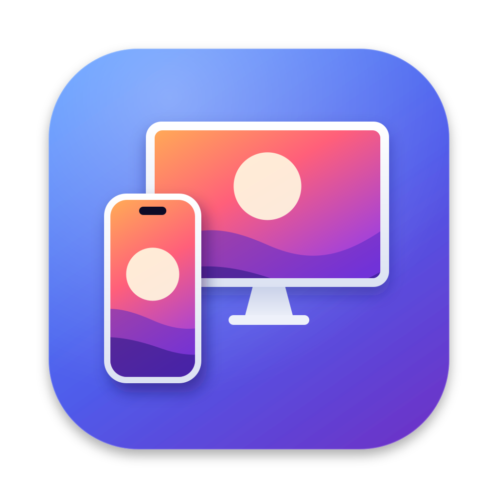

<p align="center"></p>

# iMirror

[简体中文](README.md) | English

iMirror is a menu bar AirPlay screen mirroring receiver for macOS, built with SwiftUI and the native media stack. It lives in the menu bar; mirror an iPhone, iPad or another Mac and the picture appears in a borderless floating window.

**[Download the latest version](https://github.com/erniu96/iMirror/releases/latest)** · macOS 14 or later · Apple Silicon and Intel

## Features

- Menu bar app with no Dock icon; Bonjour `_airplay._tcp` / `_raop._tcp` advertising over Wi-Fi and AWDL.
- A fresh random four-digit code for each new device; verified devices reconnect without a code.
- Hardware H.264 decoding with VideoToolbox, rendered with Metal.
- Several devices can mirror at once, each in its own window.
- Sound from the mirrored device (AAC-ELD, AAC-LC, ALAC, PCM), following the device volume.
- Borderless, resizable, always-on-top windows; hover to show stop, pin and full-screen buttons.
- Getting-started guide on first launch, and open at login.
- English and Simplified Chinese, following the system language. [More languages welcome](Documentation/LOCALIZATION.md).

## Install

Download `iMirror-<version>-macOS-universal.dmg` from [Releases](https://github.com/erniu96/iMirror/releases/latest), open it and drag iMirror onto the Applications folder.

Release builds are ad-hoc signed and not notarized, so macOS blocks the first launch. Use one of:

- **macOS 15 and later**: open iMirror once and click Done, then click Open Anyway at the bottom of System Settings → Privacy & Security and confirm.
- **macOS 14**: Control-click iMirror, choose Open, then click Open.
- **Terminal (any version)**: `xattr -dr com.apple.quarantine /Applications/iMirror.app` — also fixes "the app is damaged".

On first launch, allow local network access and follow the guide.

## Use

1. Click the iMirror icon (a phone and a display) in the menu bar to see its status.
2. On your iPhone or iPad, open Control Center and tap Screen Mirroring.
3. Choose the name with this Mac's tag, e.g. `iMirror-A7K2`, and enter the code shown on the Mac the first time.

If your device can't find iMirror, check local network permission (System Settings → Privacy & Security → Local Network on macOS 15+), that both devices are on the same Wi-Fi, and that the macOS firewall allows iMirror.

## Build from source

Requires macOS 14+ and Xcode Command Line Tools (`xcode-select --install`); Homebrew is not needed.

```bash
bash install.sh        # build and install into /Applications
./build.sh test        # build and run all tests
```

The first build downloads and compiles OpenSSL 3 (checksum verified) into `.dependencies`. See [README.md](README.md) (Chinese) for build options, packaging and release details.

## Translations

Interface text lives in `Resources/<language>.lproj/`. To add a language, copy `en.lproj`, translate it, list the code in `CFBundleLocalizations`, and run `python3 Scripts/check-localizations.py`. See the [localization guide](Documentation/LOCALIZATION.md).

## Changes

See [CHANGELOG.md](CHANGELOG.md).

## License

The protocol layer is derived from GPLv3-licensed UxPlay, so iMirror as a whole is distributed under the GNU GPLv3; see [COPYING](COPYING) and [ThirdParty/NOTICE.md](ThirdParty/NOTICE.md).
